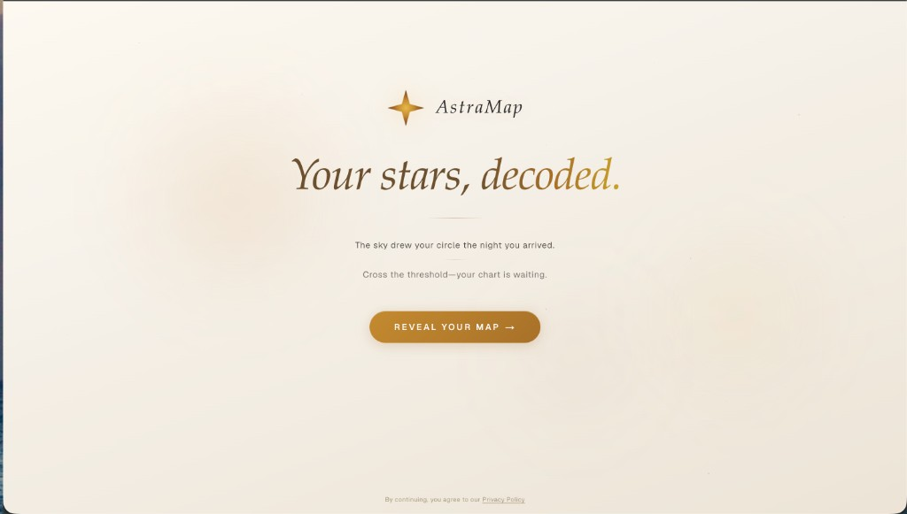
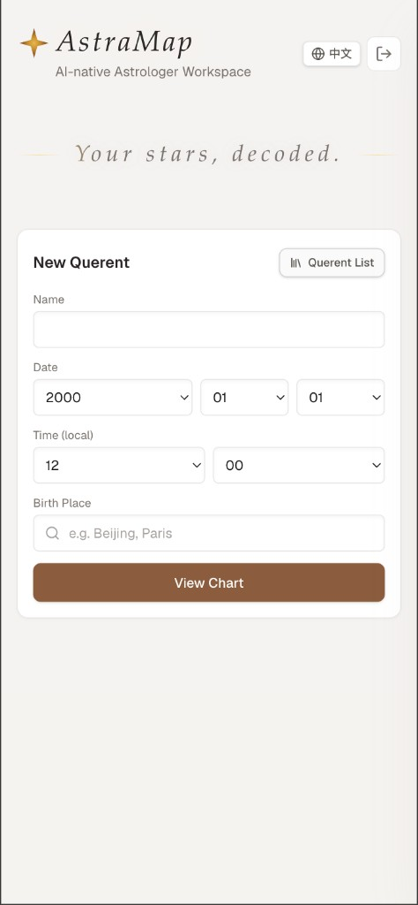
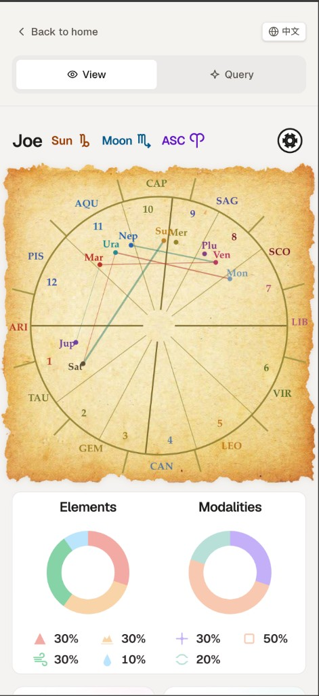
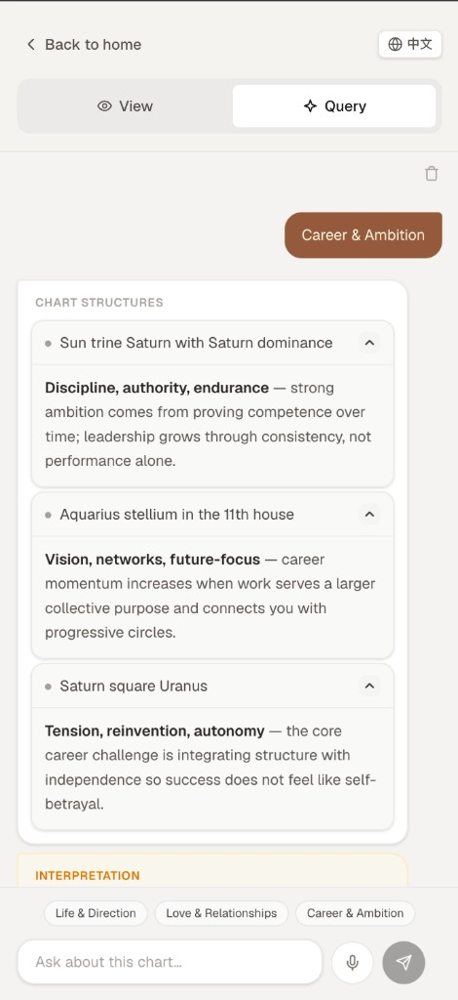
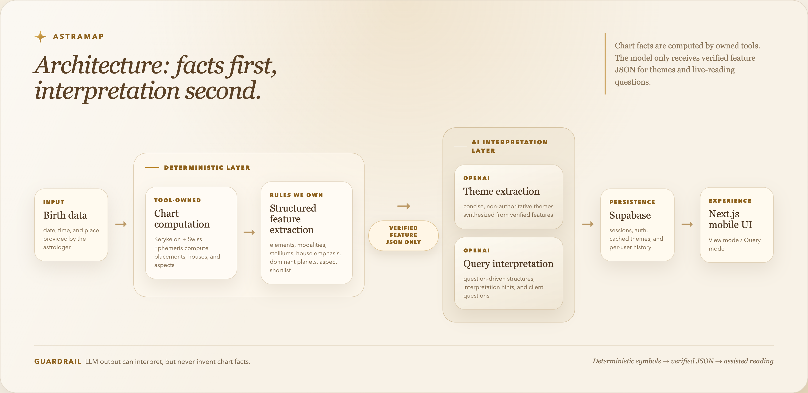

# AstraMap

<p align="center">
  
</p>

<p align="center">
  <a href="https://www.astramap.app/">Live Demo</a> &nbsp;·&nbsp; <a href="https://www.astramap.app/">Demo Video</a>
</p>

> **A mobile-first AI workspace for astrologers.** Turn raw natal-chart complexity into structured, verifiable insights — and explore them through question-driven interpretation during a live reading.

AstraMap is a CS 153 course project ("The One-Person Frontier Lab"). It is **not** a consumer horoscope app: it is a professional assistant tool that reduces an astrologer's cognitive load, surfaces the key structural patterns of a chart, and suggests directions for inquiry — while keeping the human in charge of meaning-making.

- Product notes: [docs/research-report.md](docs/research-report.md) · [docs/prd.md](docs/prd.md) · [docs/mvp.md](docs/mvp.md)

---

## Problem & motivation

A natal chart is a dense, multi-dimensional object: ~10+ bodies across 12 signs and 12 houses, plus dozens of aspects with orb tolerances. During a live session, an astrologer has to hold all of that in their head *while* having an empathetic conversation with a client. Two things go wrong:

1. **Cognitive overload** — the structural patterns that actually matter (stelliums, dominant planets, tight aspects, house emphasis) get buried in raw data.
2. **Generic AI tools fail here** — a plain "ChatGPT, read this chart" approach hallucinates chart facts and produces authoritative-sounding interpretations that astrologers can't trust or verify.

**The insight:** chart computation must be *deterministic and tool-owned*, and the LLM must only ever see precomputed, verified JSON — never invent positions or aspects. AstraMap is built around this separation so the AI assists interpretation without ever being the source of truth.

---

## What it does

- **Deterministic natal chart computation** — planetary positions, signs, houses, cusps, rulers, and aspects (with orbs) via Swiss Ephemeris. Chart facts never come from a model.
- **Structured feature extraction** — element/modality distribution, stellium detection, house emphasis, dominant planets, and an orb-filtered aspect shortlist, computed by rules we own.
- **Theme hints (LLM)** — 3–5 concise, non-authoritative themes synthesized from the feature JSON, generated in the background and cached per session.
- **Query mode (LLM)** — type or **speak** a question ("relationship hesitation") and get back *relevant structures → interpretation hints → suggested questions for the client*. Responses stream token-by-token.
- **Interactive natal wheel** — tap bodies/houses for placements, cusps, and aspects.
- **Mobile-first, multi-session** — built for phone use during live readings, with Supabase auth and per-user session history.

---

## Product Walkthrough

|  |  |  |
| --- | --- | --- |
| **Figure 1.** New querent | **Figure 2.** View mode | **Figure 3.** Query mode |

- **Figure 1:** enter birth date, time, and place to create a chart session.
- **Figure 2:** inspect the natal wheel, element / modality breakdown, and deterministic chart features.
- **Figure 3:** use Query mode to turn a real reading question into relevant structures, interpretation hints, and client follow-ups.

---

## Architecture & Repository Structure



```text
aiastrology/
├── apps/web/              # Next.js frontend for the mobile-first View and Query modes
├── services/api/          # FastAPI backend for chart computation, LLM calls, auth, and storage
│   ├── app/astro/         # Deterministic Swiss Ephemeris / Kerykeion chart pipeline
│   ├── app/llm/           # Theme and query interpretation over verified feature JSON
│   ├── .env.example       # Backend environment variables
│   ├── environment.yml    # Conda environment for local API development
│   └── requirements.txt   # Python dependencies
├── docs/                  # Product notes, research, and deployment documentation
├── docs/media/            # README screenshots and architecture images
├── apps/web/.env.example  # Frontend environment variables
├── apps/web/package.json  # Frontend scripts and dependencies
└── render.yaml            # Render blueprint for the production API
```

---

## Tech stack

- **Frontend:** Next.js 16 (App Router), React 19, TypeScript, Tailwind CSS 4, TanStack React Query, Zod, `@supabase/supabase-js`.
- **Backend:** Python 3.11, FastAPI, Kerykeion (Swiss Ephemeris), OpenAI SDK (themes / query / Whisper STT), Supabase Python client, httpx.
- **Infra:** Supabase (Postgres + Auth), Vercel (web), Render (API).

---

## Quickstart

### Prerequisites / environment

Use Node.js 20+, Python 3.11+, npm, and either Conda or a standard Python virtual environment for the API. To run the full app, configure the backend and frontend env files with an OpenAI API key and Supabase project credentials.

### Backend (`services/api`)

```bash
cd services/api
conda env create -f environment.yml   # first time only
conda activate astramap-api
cp .env.example .env                  # fill OpenAI + Supabase values
uvicorn app.main:app --reload --port 8000
```

The API runs at [http://localhost:8000](http://localhost:8000).

### Frontend (`apps/web`)

```bash
cd apps/web
npm install
cp .env.example .env.local
# Set NEXT_PUBLIC_API_URL=http://localhost:8000 and fill Supabase public values.
npm run dev
```

Open [http://localhost:3000](http://localhost:3000). 

---

## Deploy

Production is split across Vercel for `apps/web`, Render for `services/api`, and Supabase for auth and persistent storage. `render.yaml` defines the API service; the Vercel project should use `apps/web` as its root directory.

At build/runtime, the frontend needs `NEXT_PUBLIC_API_URL` pointing to the deployed Render API, plus Supabase public credentials. The backend needs OpenAI and Supabase service credentials, with CORS configured for the production web origin.

---

## Evaluation & limitations

Validation focused on protecting deterministic chart facts first, then checking whether the product felt usable in realistic reading flows.

### Evaluation evidence

- **Correctness guardrail:** chart facts are computed by `services/api`, not generated by the LLM; pytest snapshot tests over fixed birth data lock the computed `features`, with manual checks over the main live flows.
- **Failure Analysis:** On Apr 13, production testing exposed a Query-mode streaming/parsing bug around SSE chunk boundaries, `TextDecoder` flushing, and translated Markdown headings. I instrumented the path, isolated the failure, and fixed it with end-of-stream decoder flushing, a client-side fallback parser.
- **User feedback:** three friends used the app for about a week and surfaced practical reading-flow gaps.
  - They liked the mobile-first visual design and said the chart view stayed readable on a phone during quick checks.
  - They noted that real readings often start from a concrete client question, which led to Query mode and direct-answer routing instead of only a general chart summary.
  - They found it hard to recognize old sessions at a glance, which led to stronger session-list chart cues such as Sun and Moon placements.
  - Production testing also made cold starts and first-response latency visible, reinforcing that free-tier latency is a current limitation rather than a product-flow issue.

### Known limitations

- **Free-tier latency:** slow first response on Render's free tier (cold starts); not yet upgraded given small user volume.
- **Interpretation boundary:** interpretations are LLM-generated and intentionally *non-authoritative* — entertainment-oriented inquiry prompts, not conclusions; MVP excludes synastry, transits, and progressions.
- **Limited evaluation scale:** evaluation remains limited to determinism checks, production self-testing, and a small informal feedback loop; broader astrologer studies remain future work.

### Future work

- **Broader evaluation:** collect structured feedback from more practicing astrologers and compare reading workflows with and without AstraMap.
- **Richer astrology modules:** add synastry, transits, and progressions while keeping the same deterministic-facts-first guardrail.
- **Production polish:** improve session search/filtering, and make generated interpretations more traceable to the exact chart features that supported them.

---

## AI usage disclosure

Per the CS 153 AI policy, this project used AI tools substantially, with the following human/AI boundaries:

- **Human direction:** the human developer set product and technical direction, selected platforms, provided permissions/secrets, and reviewed final outputs.
- **Agent assistance:** Cursor/LLM agents helped with implementation, documentation, debugging, and iterative deployment loops.
- **Deployment tooling:** Render/Vercel MCP or platform integrations helped execute deployment, configuration, and verification steps after human authorization.
- **Reliability boundary:** deterministic chart facts are computed by astrology libraries; LLMs interpret verified structured data and should not invent chart facts.

---

## Credits & third-party

- **Astronomy:** [Kerykeion](https://github.com/g-battaglia/kerykeion) + [Swiss Ephemeris](https://www.astro.com/swisseph/) (chart computation).
- **AI:** [OpenAI](https://openai.com) (themes, query interpretation, Whisper transcription).
- **Geo:** [GeoNames](https://www.geonames.org) (city search + timezone lookup).
- **Platform:** [Supabase](https://supabase.com), [Next.js](https://nextjs.org), [FastAPI](https://fastapi.tiangolo.com), [Vercel](https://vercel.com), [Render](https://render.com).

This project builds on the above as **dependencies**; it does not fork or copy a third-party application codebase. All application code in `apps/web` and `services/api` is original to this project.

---

## License

Released under the [MIT License](LICENSE) for the original application code in this repository.

> **Note:** chart computation depends on Kerykeion / Swiss Ephemeris, whose licensing is **GPL/AGPL-adjacent**. The MIT license here covers our own code; verify the full dependency chain's licensing before any commercial distribution.

