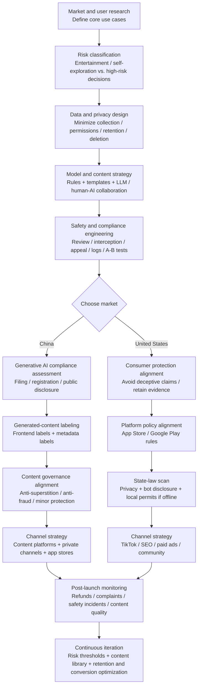

# Deep Research Report on the AI Astrology Industry and Compliance Landscape in China and the United States

## Executive Summary

As of 2026-04-04, AI astrology / AI metaphysics products in China and the United States reflect **the same underlying demand: emotional support and self-narrative**, but operate under **two different regulatory and distribution logics**. The U.S. market looks more like an open competitive environment for content- and subscription-based consumer apps, while the Chinese market is a **high-friction compliance category** shaped by content governance, generative AI filing / labeling requirements, anti-superstition policy, and anti-fraud enforcement. As a result, leading Chinese platforms tend to package astrology as “general psychology,” “self-exploration,” or “companionship,” while strengthening human service and review loops.

On the demand side, the United States has a relatively stable popular base for mysticism and astrology. A nationally representative Pew Research Center survey found that **30% of U.S. adults consult astrology, tarot, or fortune-telling at least once a year**. Most do so “for fun,” while a smaller group does so to “gain insight.” **27% say they believe in astrology**, with higher participation among young women and LGBT adults. On the supply side, astrology apps in the United States had already achieved meaningful commercialization by 2019. Sensor Tower estimated that the top 10 astrology / horoscope apps in the U.S. market generated nearly $39.7 million in revenue in 2019, representing substantial year-over-year growth, and the category continues to rely heavily on subscriptions and in-app purchases.

The size of the Chinese market is harder to measure with a single authoritative figure, but leading-platform scale and regulatory signals can serve as proxies. CeCe has disclosed tens of millions of registered users and, during 2024-2025, strengthened its “AI general psychology” positioning and large-model capabilities. Meanwhile, regulators have long treated “automated fortune-telling / online divination” as a key target in campaigns against feudal superstition, improper personal-information collection, and fraud risk. Since 2025, China’s generative AI filing / registration system has expanded rapidly. According to Cyberspace Administration of China announcements, 748 generative AI services had completed filing by the end of 2025, and 796 had completed filing by 2026-02-28. Combined with the implementation of generated / synthetic content labeling rules, “AI astrology” in China is increasingly a competition in **compliance engineering + product engineering**.

---

## Platform Landscape and Comparison

This section samples mobile products in AI astrology, divination, natal-chart interpretation, and general psychology. It prioritizes company websites, app store pages, third-party monitoring sources such as Sensor Tower / Appfigures, and authoritative media. Fields without reliable sources, such as MAU or revenue, are marked as “undisclosed.” For a small number of launch dates, app-store version history or review timestamps are used as a **verifiable lower bound**, meaning the product was operating no later than that date; this is noted in the tables where relevant.

### Major Chinese Platforms

| Platform (China) | Founded / launched | Core form (AI vs. human) | NLP / GenText | Image | Personalization | Real-time chat | User scale / MAU | Monetization | Distribution | Major regulatory / compliance constraints |
|---|---:|---|---|---|---|---|---|---|---|---|
| CeCe | 2011 group / 2013 app | “General psychology + astrology / tests” community; AI and human consultants in parallel | Yes. Self-developed large model used for emotional support / companionship and related scenarios. | Undisclosed | Yes, based on personal information, profiles, and test results. | Yes. 24/7 AI plus human consultants / creators. | About 46 million registered users disclosed by the platform; MAU undisclosed. | Membership subscription + paid consulting / paid content; exact structure undisclosed. | Mobile app; specific channels undisclosed | Anti-superstition / anti-fraud content governance, with “automated fortune-telling / online divination” specifically named in enforcement. Generative AI filing / disclosure and content-labeling systems if generative capabilities are provided. Personal-information compliance under PIPL. Advertising may not contain “superstitious” content. |
| Zhunle | Undisclosed | Astrology / horoscope content + paid interpretation; consumer-facing “AI question” and service-agreement system | Yes. Claims a “metaphysics AI large model” supporting free questions / answers. | Undisclosed | Yes, around personal charts and question contexts. | Undisclosed, though service agreements imply online Q&A scenarios. | Undisclosed | Subscription / membership and related paid services, based on service agreements. | WeChat ecosystem appears to be an important entry point based on agreement domains. | Same broad constraints: feudal superstition governance and anti-fraud orientation. If generative or recommendation algorithms are used, filing, labeling, and log-retention requirements may be triggered. Advertising restrictions on “superstition.” Personal-information compliance under PIPL. |
| Lingji Bazi Fortune Telling | Undisclosed | Traditional fortune-telling such as Bazi / Zi Wei Dou Shu plus celebrity-endorsed teachers / consultants; AI capabilities not fully disclosed | Undisclosed; presented more as automated calculation and interpretation. | Undisclosed | Yes, based on birth information / destiny charts. | Yes, through paid consulting / service conversion, though exact form is undisclosed. | Reported downloads exceeded 8.5 million as of a 2021 report; MAU undisclosed. | Paid consulting, value-added services, and derivative products; reports mention multiple monetization methods. | Visible overseas on Google Play; mainland China channels undisclosed. | In the Chinese context, more likely to be categorized as the high-risk “automated fortune-telling / online divination” category and receive enforcement attention. Advertising restrictions on “superstition.” Personal-information compliance under PIPL. |
| Tatawu | Undisclosed; available on iOS | AI tarot + natal-chart algorithms; emphasizes continuous conversation / companionship | Yes. “Professional AI tarot advisor” and continuous Q&A interaction. | Undisclosed | Yes, personalized interpretation driven by chart / question context. | Yes, continuous conversation. | Undisclosed | IAP / subscription; details undisclosed. | iOS App Store, visible in overseas regions. | If provided to mainland China users as a generative service, it must consider generative AI filing / labeling and content governance. Feudal superstition and anti-fraud governance. Personal-information compliance under PIPL. |
| Tarot Frog | Undisclosed; downloadable on iOS by at least 2024-05 | AI interpretation + human 1:1 consulting; stronger tool orientation | Partial. Description includes “AI interpretation” and emphasizes spreads / card-reading assistant. | Undisclosed | Yes. Generates interpretations from questions, charts, dreams, and related inputs. | Partial. Human 1:1 and membership systems are explicit; whether AI supports real-time chat is undisclosed. | Undisclosed | Subscription / membership auto-renewal. | iOS App Store, visible in overseas regions. | Similar content and personal-information risks. If generative capability is provided, labeling, review, and filing / registration should be considered. Advertising restrictions on “superstition.” |

### Major U.S. Platforms

| Platform (U.S.) | Founded / launched | Core form (AI vs. human) | NLP / GenText | Image | Personalization | Real-time chat | User scale / MAU | Monetization | Distribution | Major regulatory / compliance constraints |
|---|---:|---|---|---|---|---|---|---|---|---|
| Starla | 2025; earliest iOS version records date to 2025-03. | AI + shareable hooks, including soulmate portraits and Q&A / guidance | Yes. Based on descriptions such as “expert systems,” provides Q&A-style guidance. | Yes, including “soulmate drawing” and related features. | Yes, relationship / goals / pattern-oriented personalized outputs. | Yes; version history mentions “chat with them.” | Appfigures reported that since early 2025-06 it added about 2.2 million users and generated about $2.5 million in revenue before platform fees. | Subscription / IAP, including monthly plans such as $14.99. | Primarily iOS App Store; Appfigures indicates U.S. downloads and revenue dominate. | Consumer protection and advertising truthfulness under the FTC Act, which prohibits deceptive marketing. Claims about accuracy / effectiveness require substantiation. Platform rules: Apple explicitly lists “fortune telling” as a saturated category requiring a unique, high-quality experience. Google Play states that labeling an app as “entertainment” does not exempt deceptive behavior. Privacy and minors, including COPPA. California bot disclosure law SB-1001 may require bot identity disclosure in commercial transaction contexts. |
| Co-Star | 2017, based on common media and platform accounts. | Hybrid astrology / social product using NASA data, human astrologers, and AI collaboration | Partial / yes. Explicitly describes collaboration between human astrologers and AI, and launched Q&A features such as The Void / Ask. | Undisclosed | Yes, based on minute-level birth time / location. | Yes, Q&A features and social interaction. | Reported around 30 million accounts; average user age 18-25. | Subscription + IAP; details undisclosed | iOS / Google Play official pages available. | Same: FTC anti-deception and advertising substantiation. Platform saturation-category and “entertainment does not exempt deceptive behavior” rules. Privacy compliance, mostly state-law driven. |
| The Pattern | 2017, based on founder interviews and mainstream media reports. | Psychological-insight-style astrology / relationship analysis; AI capability not emphasized | Undisclosed; appears more like structured content library + personalized distribution. | Undisclosed | Yes, relationship / timeline / content-library personalization. | Partial; social / matching / chat features appear in subscription benefits. | Undisclosed; interviews mention significant user growth during the pandemic, but total scale is undisclosed. | Subscription, including “Go Deeper+.” | iOS / Android app stores. | Same constraints, and if a bot-like experience impersonates a human to induce purchases in California, SB-1001 disclosure obligations may be triggered. |
| Sanctuary | 2019; media reports place service launch around 2019-03. | Emphasizes “real experts, not algorithms,” with interactive charts and on-demand readings | Undisclosed; core selling point is live / on-demand readings with professionals. | Undisclosed | Yes, chart generation from birth data and expert matching. | Yes, live / on-demand text readings. | Platform claims 100K+ readings, 50K+ customers, and 15M+ horoscopes delivered. | Membership subscriptions + per-reading / time-based expert services. | iOS / Android app stores. | Strong consumer-protection constraints around pricing, cancellation, and representations of expert credentials; FTC deceptive-marketing rules. Privacy and minors, including COPPA. |
| Nebula | 2019; user reviews exist in app stores by at least 2019-10. | Content + human advisor marketplace + live chat; some functions can be understood as algorithmic distribution | Undisclosed; descriptions emphasize content and human advisors. | Undisclosed | Yes, zodiac compatibility, natal charts, daily content. | Yes; claims 1,500+ advisors and 24/7 live chat readings. | In-app description says “over 12 million astrology lovers”; media reports cite “30 million users,” so figures should be treated cautiously. | Subscription + “chat balance” IAP. | iOS / Android app stores. | Same: FTC anti-deception, subscription / payment transparency, platform “entertainment does not exempt deceptive behavior” rules. Privacy and data-tracking disclosures, including app-store privacy labels. |
| CHANI | Undisclosed | Content / courses / meditations + astrology tools; more like productized author-brand content | Undisclosed | Undisclosed | Yes, birth chart plus daily / weekly content and subscription benefits. | Undisclosed | Undisclosed | Premium subscription unlocks content. | iOS / Android app stores. | Same: advertising and subscription compliance, privacy compliance, and extra caution if content is directed to minors under COPPA. |

---

## Market and Demand Context

U.S. demand can be described through both participation rates and paid-market proxies. First, Pew Research Center’s October 2024 survey found that 30% of U.S. adults participate in astrology, tarot, or fortune-telling each year. Most do so primarily for entertainment (20%), while a smaller share does so to gain useful insight (10%). Only a very small minority rely heavily on these results for major decisions, with “rely a lot” at about 1%. Second, U.S. astrology apps had already built a meaningful mobile paid market by 2019: Sensor Tower reported that the top 10 astrology and horoscope apps in the U.S. generated nearly $39.7 million in revenue that year, with significant growth, a statistic also repeated by mainstream tech media. Third, in a broader “mystical services” category, IBISWorld estimates the U.S. “Psychic Services” industry at about $2.3 billion in 2026, covering palm reading, card reading, and other traditional services, which can serve as a proxy for combined offline / online demand.

The U.S. user structure and cultural acceptance show “mainstreaming, but mostly light-decision use.” Pew’s report not only gives the overall participation rate, but also notes that younger people, especially young women and LGBT adults, are more active in astrology, tarot, and related practices. The broader trend of being “spiritual but not religious” also expands the cultural space for such products: Pew’s 2023 report on U.S. spirituality found that about 70% of U.S. adults consider themselves “spiritual” in some sense. This cultural backdrop, combined with short-video distribution and shareable lightweight content assets such as soulmate drawings, makes it easier for AI-native astrology products to achieve viral growth. In its review of Starla’s growth, Appfigures explicitly linked its spread to TikTok and shareable hooks, reporting about 2.2 million new users and $2.5 million in pre-platform-fee revenue as an interim result.

Chinese demand is harder to quantify through authoritative industry statistics, but can be observed through three proxies: leading-platform user scale, the abundance of astrology content on social platforms, and regulatory language. Publicly disclosed user counts from leading platforms indicate that general psychology / astrology / testing products do have a mass-market base. CeCe has been described in public reports as having tens of millions of users, with a reported female user share of about 85%. At the same time, academic research on astrology content in Chinese social media provides an interpretive frame: research on astrology short videos on Douyin suggests that astrology content is used for identity construction and intimacy sensemaking, reinforcing the consumer motivation to manage uncertainty through narrative.

However, the Chinese supply side is constrained by stronger governance, directly shaping scalable product forms. In the 2022 “Qinglang” campaign, the Cyberspace Administration of China explicitly called for strict enforcement against the promotion of feudal superstition and named illegal personal-information collection or fraud through “automated fortune-telling” and “online divination” as enforcement targets. Another more distribution-oriented signal comes from media investigations: in some domestic Android app stores, keywords such as “AI fortune-telling” were difficult to search for, and reports emphasized potential fraud and personal-information risks. Under these constraints, leading Chinese platforms tend to embed “astrology” within narratives of emotional support, companionship, psychological comfort, and growth records, and reduce risk through human-AI collaboration and review loops. CeCe emphasized its transition toward AI general psychology and large-model capabilities in 2024.

---

## Regulatory and Legal Constraints

### China

China’s constraints on AI astrology come from three main lines: **content governance against superstition / fraud**, **generative AI filing and labeling systems**, and **personal-information protection plus advertising compliance**.

First, at the content-governance level, “automated fortune-telling / online divination” is explicitly included in “Qinglang” enforcement targets and tied to risks such as illegal personal-information collection and fraud. This means that if a product markets itself as “high-tech automated fortune-telling” at scale, regulatory risk is not only about values or superstition, but may expand into fraud and personal-information investigation chains.

Second, generative AI compliance engineering became much more important during 2024-2026. The Cyberspace Administration of China has continuously published information on filed generative AI services and requires launched applications to publicly display the model name and filing number / identifier in prominent locations. By the end of 2025 and the end of February 2026, filed services had reached 748 and 796 respectively. During the same period, the generated / synthetic content labeling system took effect. The Cyberspace Administration, MIIT, the Ministry of Public Security, and the National Radio and Television Administration issued the Measures for Labeling AI-Generated Synthetic Content, effective 2025-09-01; the supporting national standard GB 45438-2025 provides labeling methods. For AI astrology, any public generative dialogue, text, or image capability should treat content labeling, capability disclosure, review, and logging as default engineering requirements rather than optional add-ons.

Third, personal-information and advertising compliance. On the personal-information side, PIPL establishes principles of legality, legitimacy, necessity, and higher thresholds for cross-border transfer and sensitive information. Astrology products naturally process birth date, birth time, location, relationship status, and descriptions of emotional or psychological distress, all of which create personal-information processing scenarios. On the advertising side, China’s Advertising Law prohibits advertising from containing “superstitious” content and sets penalties for unlawful advertising. This directly limits acquisition copy and paid-media claims: the more a product promises inevitable accuracy, fate-changing luck, or disaster relief, the more likely it is to trigger both advertising and anti-fraud risk.

At the platform level, CeCe’s parent entity has disclosed that its “Xinyuan large model” has passed relevant filing, and public filing-reference lists do contain an entry for “Xinyuan large model.” This suggests that at least some emotional-support / companionship model capabilities are being brought into a compliant filing framework. But filing does not mean a product may generate any kind of fortune-telling content. Generated / synthetic content still must satisfy content safety, labeling, and review responsibility chains.

### United States

U.S. constraints on AI astrology are generally more about **consumer protection, privacy, platform review, and localized regulation**, rather than a unified anti-superstition content regime.

First, at the federal level, the core issue is consumer protection and truth in advertising. Section 5 of the FTC Act prohibits unfair or deceptive acts or practices. Therefore, any misleading statement in marketing or product pages that affects consumer decisions may create compliance risk, regardless of whether the product claims to be “for entertainment.” The principle that advertising claims require substantiation also applies to AI astrology products. FTC substantiation principles require advertisers to have a reasonable basis for claims before making them; objective claims about being scientific, accurate, or effective usually require a higher evidentiary standard. In recent years, the FTC has also launched enforcement around AI hype and deceptive schemes through Operation AI Comply, increasing scrutiny of AI-themed marketing.

Second, privacy and child protection. If a product reaches, or can reasonably be expected to reach, children, COPPA and its implementing rules impose strict requirements on data collection and parental consent. The FTC also issued enforcement and policy signals in 2025 regarding changes to child data-protection rules. At the state level, privacy obligations are mainly composed of state consumer privacy laws. For mobile products, data minimization, transparent disclosure, and opt-out mechanisms have become baseline industry expectations.

Third, platform review rules directly affect the commercial feasibility of astrology products. Apple’s App Review Guideline 4.3 explicitly lists “fortune telling” as an example of a saturated category and states that such apps may be rejected unless they provide a unique, high-quality experience. Apple also states that claiming an app is for entertainment does not overcome rules against misinformation or false functionality, which affects overpromising product narratives. Google Play similarly states in its Deceptive Behavior policy that claiming an app is a prank or “for entertainment purposes” does not exempt it from deceptive-behavior policies.

Fourth, local laws are fragmented but still relevant edge constraints. For example, California SB-1001, passed in 2018 and effective 2019-07-01, makes it unlawful to use a bot online in California to interact with people while misleading them about its artificial identity in order to incentivize a commercial transaction or influence voting; clear disclosure of bot identity can exempt the actor from this rule. In addition, some jurisdictions regulate offline or service-providing “fortune telling” through license / permit / anti-fraud rules. New York criminal law defines paid “fortune telling” and creates a performance / entertainment exception. Some California cities also have “fortune telling permit” systems, explicitly aimed at reducing fraud and theft risk. These rules may not directly apply to pure online apps, but they affect commercial designs involving offline expansion, human astrologer marketplaces, or paid offline events.

```text
China: official / quasi-official high-priority links
https://www.cac.gov.cn/2024-04/02/c_1713729983803145.htm
https://www.cac.gov.cn/2026-01/09/c_1769688009588554.htm
https://www.cac.gov.cn/2022-01/24/c_1644627964425577.htm
https://www.cac.gov.cn/2025-03/14/c_1743022023438221.htm
https://openstd.samr.gov.cn/bzgk/gb/newGbInfo?hcno=E4E4E9ECA3BCB410CEB77FADCFDDFFDE
https://www.mod.gov.cn/gfbw/fgwx/flfg/4892505.html
https://www.beijing.gov.cn/zhengce/zhengcefagui/qtwj/202008/t20200803_1970538.html

United States: official / authoritative high-priority links
https://www.ftc.gov/legal-library/browse/statutes/federal-trade-commission-act
https://www.law.cornell.edu/uscode/text/15/45
https://www.ftc.gov/sites/default/files/attachments/training-materials/substantiation.pdf
https://www.ftc.gov/legal-library/browse/rules/childrens-online-privacy-protection-rule-coppa
https://www.ecfr.gov/current/title-16/chapter-I/subchapter-C/part-312
https://developer.apple.com/app-store/review/guidelines/
https://play.google.com/about/privacy-security-deception/deceptive-behavior/deceptive-settings/
https://leginfo.legislature.ca.gov/faces/billTextClient.xhtml?bill_id=201720180SB1001
https://www.nysenate.gov/legislation/laws/PEN/165.35
```

---

## Competitive Landscape and Product Experience Patterns

The UX patterns of AI astrology products in China and the United States can be abstracted into three layers of trust production: **authority anchors**, **verifiable structure**, and **emotional closure**.

For authority anchors, U.S. products often use scientific symbols such as “NASA data” as an entry point for credibility. For example, Co-Star emphasizes on its website and store pages that it uses NASA data to calculate real-time planetary positions and combines human astrologers with AI to generate content. Starla also emphasizes “real NASA data + expert systems” in its app-store description. This narrative reduces the feeling of superstition and positions the product closer to a data-driven self-knowledge tool. From a compliance perspective, however, it also raises the evidentiary bar for claims about accuracy or scientific validity, especially under U.S. FTC standards.

For verifiable structure, mature products tend to offer a structured chain: birth information → natal / relationship chart → timeline / aspects / transits → textual explanation. This avoids becoming a complete black box. Co-Star emphasizes minute-level birth information and compatibility analysis; The Pattern and CHANI emphasize relationship insight, timelines, content libraries, courses, and audio tools. Chinese platforms lean more toward a combination of tools, community, and service marketplaces: charts / tests serve as structural entry points, while creators, consultants, and voice services increase personalization and interpretability. CeCe reportedly works with a large number of creators and consultants and offers 24/7 service forms.

For emotional closure, the strongest growth lever in the last two years has often not been “more accurate,” but “more shareable” and “more companion-like.” Appfigures attributes Starla’s breakout directly to TikTok distribution and highly shareable assets such as soulmate portraits, even though its subscription price is not low. Nebula and Sanctuary use real-time chat and human consulting as paid emotional-closure vehicles, shaping a “psychological support substitute that is always available” through large advisor supply and 24/7 availability claims. From a risk perspective, this companionship framing significantly increases users’ dependence and payment impulses during vulnerable moments. It therefore requires stronger risk controls and health boundaries. In China, this is more likely to trigger public-opinion and regulatory concerns around induced spending, fraud, and personal-information abuse; in the United States, it is more likely to trigger FTC scrutiny of deceptive design and subscription traps.

---

## Monetization Strategy and Quantitative Benchmarks

Quantitative U.S. benchmarks mainly come from third-party monitoring and public reporting. Sensor Tower reported that the top 10 U.S. astrology and horoscope apps generated nearly $39.7 million in 2019, a figure also repeated by TechCrunch with emphasis on growth. Combined with Pew’s structure of 30% annual participation but mostly entertainment-driven use, this suggests that the category monetizes more like a “light-decision, high-repeat” content subscription product than a high-ticket one-time decision service.

At the product level, three monetization modules appear frequently.

First, subscriptions provide recurring cash flow. Starla’s iOS page includes $14.99 / month and annual subscription tiers. CHANI clearly uses Premium subscriptions to unlock more birth-chart interpretations, weekly content, audio, and related benefits.

Second, per-use / metered payment through IAP credits or chat balances. Nebula’s iOS IAP list explicitly includes items such as “Chat Balance $9.99,” indicating that it treats chat as a metered paid resource. Sanctuary also highlights “live, on-demand readings with professionals” in app-store pages, typically corresponding to per-reading or time-based service-marketplace monetization.

Third, viral single-purpose paid assets. In Appfigures’ review of Starla’s growth, soulmate portraits are described as shareable hooks corresponding to payment motivation. Appfigures also provides interim revenue and user-growth data, making it a real-world example of a “viral acquisition → subscription conversion” path.

Chinese revenue and payment structures are harder to verify, but the monetization logic is highly similar to the U.S. pattern of subscriptions plus metered services, with an additional layer of creators / consultants and live / voice services. CeCe has publicly disclosed the scale of its creator and consultant partnerships and emphasized 24/7 service capabilities and general psychology scenarios. This supply structure typically corresponds to a combination of memberships, paid Q&A, voice / consulting, courses, and paid content. A special caution in China is that such products are more likely to be evaluated by public opinion and regulators through the chain of induced spending, fraud, and improper personal-information collection. Media investigations have already noted tactics and risks in AI fortune-telling apps, and some Android app stores have tightened search results for related keywords.

---

## Risks, Ethical Issues, and Practical Mitigations

The risks of AI astrology are not limited to disputes over scientific validity. They are concentrated in **psychologically vulnerable contexts, deceptive design, data and privacy, and the unpredictability of generated content**. Recent regulators and researchers have increasingly focused on potential harms from companion chatbots. In 2025-09, the FTC launched a 6(b) inquiry into AI companions, focusing on how companies assess and monitor negative effects on children and teenagers. Academic and professional institutions have also urged caution about generative AI in mental-health contexts. Stanford HAI has warned about reliability in crisis hotline / high-risk settings and emphasized testing and evaluation. The APA has also issued risk alerts and recommendations around mental-health chatbots.

Given Chinese and U.S. regulatory realities, risk governance can be decomposed into four practical modules.

**Product claims and boundary management:** avoid language that guarantees predictions, promises to change fate, or substitutes for medical / psychological treatment. In the United States, this is directly related to FTC deceptive-marketing and substantiation risk; in China, it also triggers Advertising Law restrictions on superstition and the anti-fraud / Qinglang governance context. It is also important to recognize that “for entertainment” is not a shield: both Apple and Google Play explicitly state that entertainment or prank framing does not exempt products from misinformation or deceptive-behavior policies.

**Dialogue safety and escalation:** classify user inputs into risk levels, such as general emotional distress, major financial / legal / medical decisions, or possible self-harm risk. High-risk categories should trigger refusal, reframing, help-seeking suggestions, or human escalation. If the product offers human consulting, it should establish credential review, blacklists, and conversation logging to handle disputes and regulatory inquiries. The FTC’s attention to companion-bot harms also suggests a need for continuous monitoring of negative impacts rather than one-time disclaimers.

**Data minimization and sensitive-information protection:** astrology products naturally need birth date, time, and place, but should avoid using sensitive relationship, sexual-orientation, or psychological-distress details for advertising tracking or cross-product profiling. In China, products must respect PIPL’s processing boundaries and rights protections. In the United States, they must align with state privacy laws and app-store privacy label disclosures.

**Generated-content traceability and labeling:** in China, generated / synthetic content labeling rules have a clear effective date and national standards. For controversial categories such as AI astrology, labeling and logging are not only compliance requirements but also infrastructure for risk control and dispute handling.

---

## Product Launch Recommendations and Rollout Process

### Product Strategy for China

For positioning, the more feasible route is not “fortune-telling,” but **self-exploration + emotional companionship + relationship communication tools**, with astrology / tarot serving as narrative and interactive media. This is similar to CeCe’s “general psychology” route and large-model capability positioning. This route is easier to connect to psychological comfort and growth records in regulatory language, rather than to feudal superstition or fraud.

For the compliance checklist, the following should be treated as pre-launch gates rather than post-launch patches: whether generative AI filing / registration and public disclosure obligations are triggered, especially for public dialogue generation; generated-content labeling capability, including front-end labeling and metadata labeling; content-safety review / interception / complaint mechanisms; and the full personal-information processing lifecycle under PIPL: notice, consent, minimization, rights response, and cross-border assessment. Acquisition materials and copy must avoid superstition-style strong promises, because Advertising Law restrictions on “superstitious content” move distribution risk upstream.

For channels, tighter Android app-store search and the Qinglang enforcement language mean that public, large-scale distribution is harder to control. A more realistic growth path is often content platforms, such as short video and posts, plus private channels such as communities, official accounts, or mini programs. This still requires stronger content review, anti-fraud controls, and user education.

### Product Strategy for the United States

The U.S. market allows more aggressive AI-native interaction, but consumer protection should be treated as the central constraint. Any objective claim about scientific accuracy, future prediction, or life improvement can trigger substantiation risk. Safer language should prioritize “reflection prompts,” “entertainment,” and “self-discovery tool” framing.

For growth, Starla shows that shareable assets such as images, character portraits, or generated cards plus TikTok distribution can significantly reduce customer-acquisition cost. Sustainability, however, depends on subscription retention and refund experience. Subscription transparency, cancellation paths, and expectation management after payment should therefore be key experience points. App Store reviews have already shown dissatisfaction around waiting even after payment. Apple’s saturated “fortune telling” category rule also matters: passing review and staying listed long-term requires differentiated, non-template experiences and accurate metadata disclosures about capability boundaries.

For compliance, beyond FTC and state privacy laws, California SB-1001’s bot-disclosure obligation should be included in design. At key paid-conversion points in a conversation, clearly stating “you are interacting with AI” can reduce legal and reputational risk.

### Launch Process: Shared China / U.S. Framework with Branch Differences



---

**Key conclusion:** If the goal is a scalable AI astrology product, the U.S. looks more like a growth- and monetization-driven product competition, while China looks more like compliance-system-driven product engineering. The main U.S. barriers are **FTC anti-deception and evidentiary requirements + platform review rules around saturated categories and deceptive behavior**. The main Chinese barriers are **anti-superstition / anti-fraud content governance language + generative AI filing / labeling systems + personal-information protection**.
